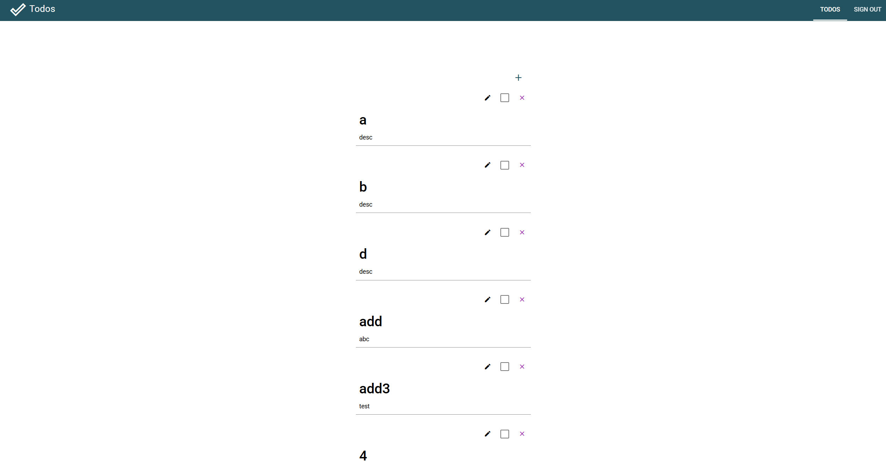
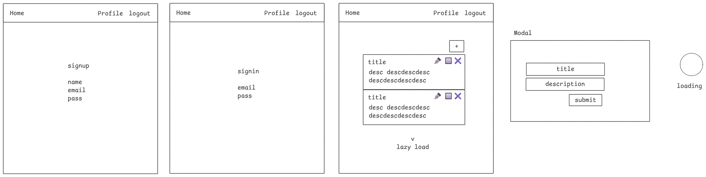

# v-todos



# Usage

## Run the backend

1. Copy content of [example](./example) to `./env`
2. Run `docker compose up -d`

## Run the frontend

[Frontend repo](https://github.com/muhammadihabk/v-todo-frontend)

1. Copy content of [example](./example) to `./env`
2. Run `npm run dev`.
3. Navigate in browser to `http://localhost:9000`

# Requirements

- Auth
  - sign up and sign in.
- Todos: User can
  - Create a todo.
  - View todos.
  - Update description (Not implemented).
  - Mark as completed (Not implemented).
  - Delete a todo (Not implemented).

# Tech Specs

## Frontend



## Backend

### Database Design

**User**

```json
{
  name: string,
  email: string,
  salt: string,
  hash: string
}
```

**Todo**

```json
{
  title: string,
  description: string,
  completed: boolean,
  userId: reference,
  createdAt: string,
  updatedAt: string
}
```

### API Design

**Auth**

| Action  | Route             |
| ------- | ----------------- |
| Sign up | POST /auth/signup |
| Sign in | POST /auth/signin |
| Logout  | POST /auth/logout |

**Todo**

| Action             | Route            |
| ------------------ | ---------------- |
| Add new todo       | POST /todo       |
| Get all user todos | POST /todo/find  |
| Update todo        | PATCH /todo/:id  |
| Delete todo by id  | DELETE /todo/:id |
